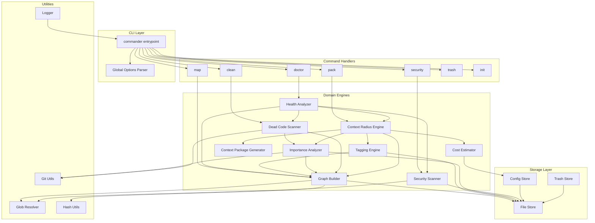
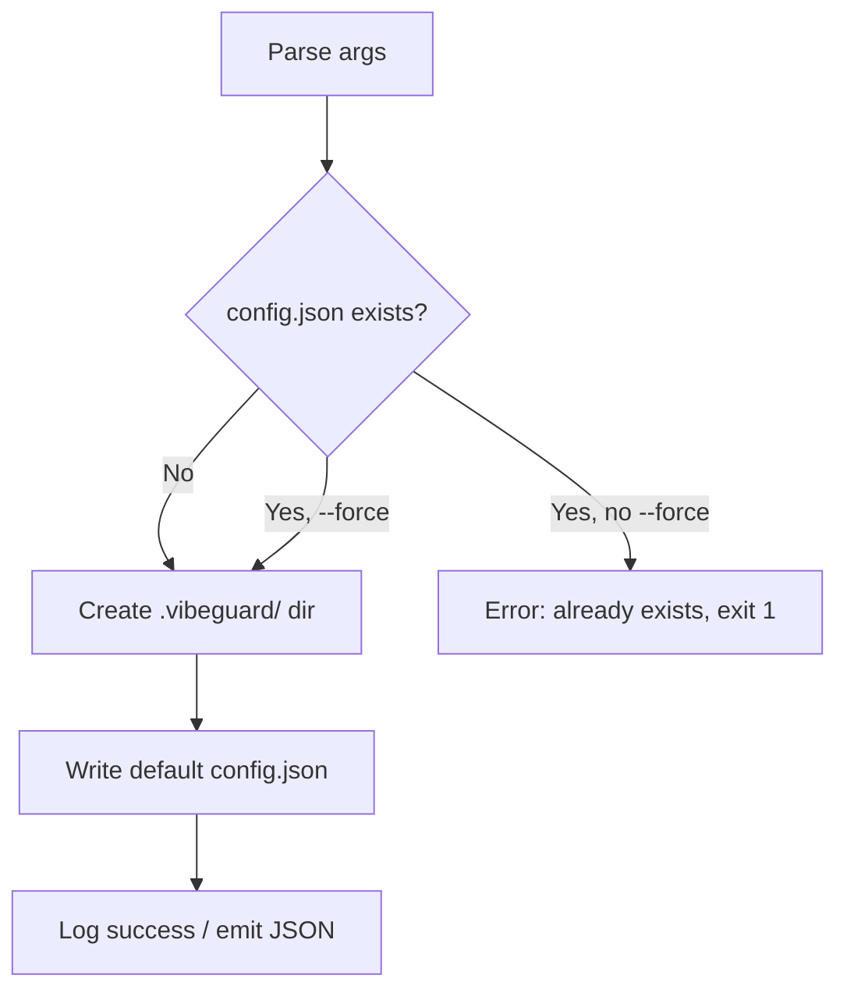
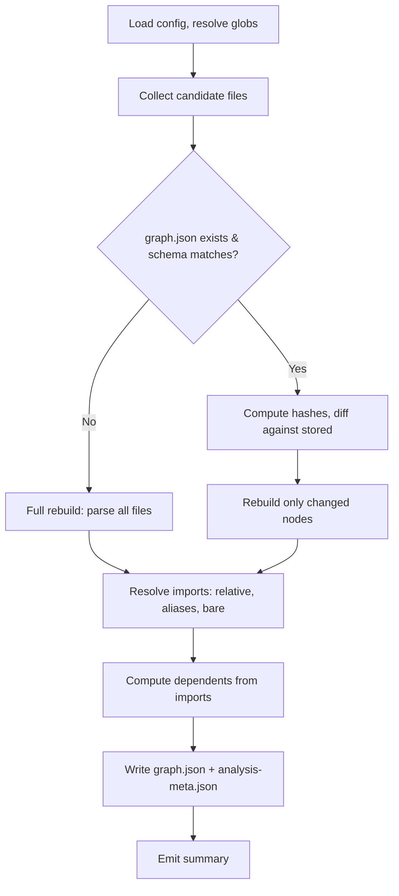
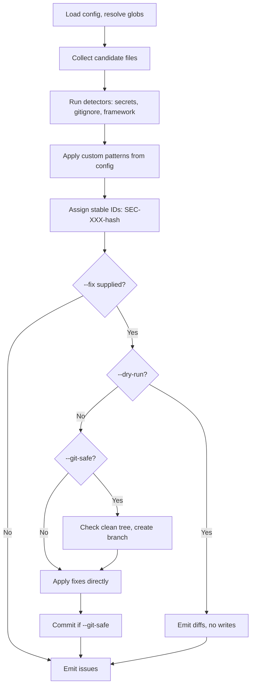
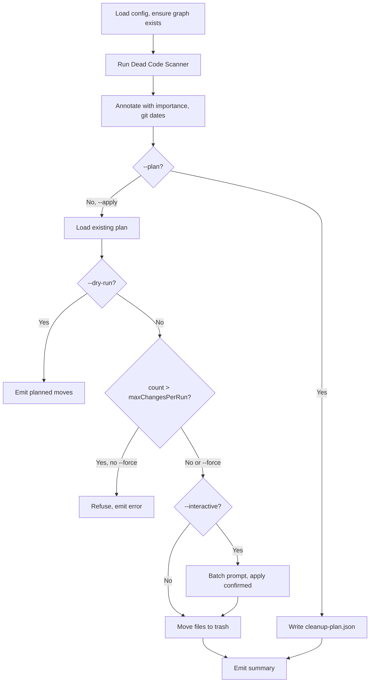
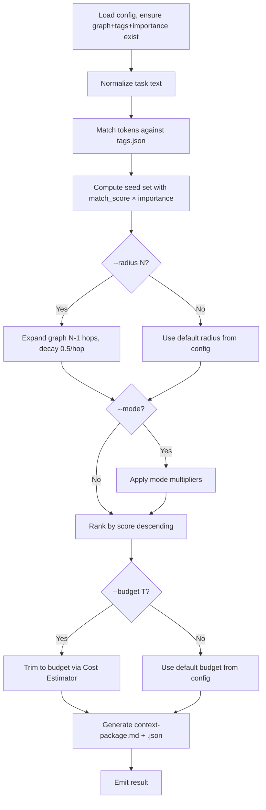
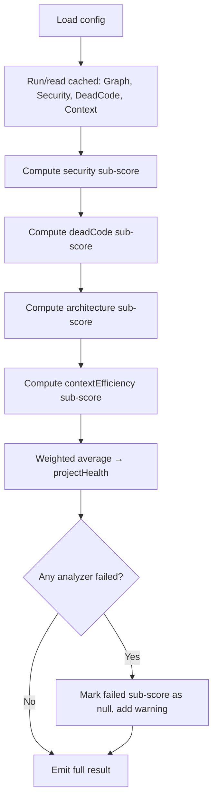
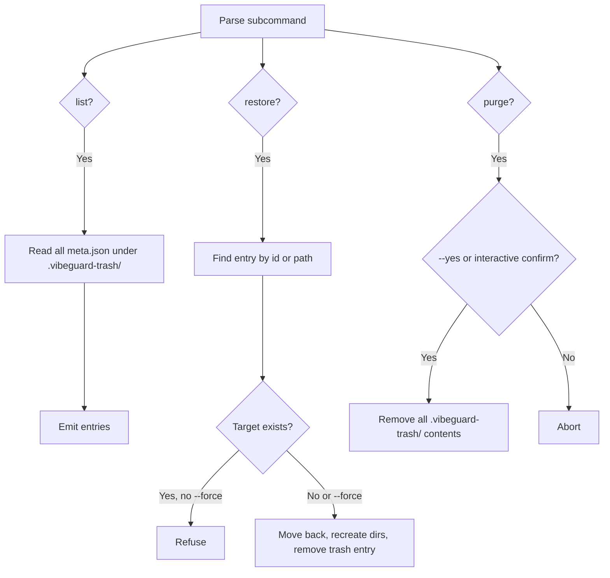

# Design Document: VibeGuard CLI

## Overview

VibeGuard is a local-only, zero-AI-dependency CLI tool for TypeScript/JavaScript projects that performs static analysis to reduce AI agent token costs, detect security issues, identify dead code, and produce focused context packages. The architecture follows a layered design: a thin CLI shell delegates to command handlers, which orchestrate domain engines, which read/write through a unified storage layer.

Key design decisions:
- **No external AI calls** — all analysis is local static analysis via `ts-morph` and the `typescript` compiler API.
- **JSON-file persistence** — all artifacts live under `.vibeguard/` as versioned JSON files; no database.
- **Incremental by default** — SHA-256 content hashing enables skip-if-unchanged semantics for every analyzer.
- **Safety-first mutations** — all writes route through a trash-backed store; hard deletes are impossible.
- **Dual output** — every command emits human-friendly terminal output OR a single stable JSON document, never both on stdout.

## Architecture



### Module Boundaries

| Layer | Responsibility | Dependencies |
|-------|---------------|--------------|
| CLI Layer | Parse argv, wire global options, dispatch to command handler | `commander`, Command Handlers |
| Command Handlers | Orchestrate engines, format output, enforce safety flags | Domain Engines, Storage Layer, Logger |
| Domain Engines | Pure analysis logic, produce typed results | Storage Layer (read), Utilities |
| Storage Layer | Read/write JSON artifacts, enforce schema versions | `fs-extra`, Hash Utils |
| Utilities | Cross-cutting: logging, git, globs, hashing | `chalk`, `ora`, `child_process` |

### Dependency Flow Rules

1. CLI Layer → Command Handlers → Domain Engines → Storage/Utilities
2. No upward dependencies (engines never import from commands or CLI)
3. Domain engines may depend on other engines (e.g., HealthAnalyzer depends on SecurityScanner)
4. Storage layer is the only module that touches the filesystem for `.vibeguard/` artifacts

## Components and Interfaces

### CLI Entrypoint (`src/cli.ts`)

```typescript
interface GlobalOptions {
  json: boolean;
  cwd: string;
  include: string[];
  exclude: string[];
  config: string | undefined;
  verbose: boolean;
  quiet: boolean;
}

interface CommandContext {
  options: GlobalOptions;
  config: ResolvedConfig;
  logger: Logger;
  projectRoot: string;
}
```

### Config Store (`src/storage/config-store.ts`)

```typescript
interface VibeguardConfig {
  ignore: string[];
  tags: { customRules: TagRule[] };
  importance: { weights: ImportanceWeights };
  security: { customSecretPatterns: string[] };
  context: {
    defaultRadius: number;
    defaultTokenBudget: number;
    models: Record<string, ModelConfig>;
  };
  clean: { maxChangesPerRun: number };
  limits: { maxFilesPerRun: number };
}

interface ImportanceWeights {
  dependents: number;
  imports: number;
  git: number;
  route: number;
}

interface ModelConfig {
  tokensPerKiloChar: number;
  pricePer1K: number;
}

interface TagRule {
  match: string;  // glob pattern
  add: string[];  // tags to add
}

interface ResolvedConfig extends VibeguardConfig {
  effectiveSkipSet: string[];   // merged ignore + --exclude
  effectiveInclude: string[];   // --include or default extensions
}
```

### File Store (`src/storage/file-store.ts`)

```typescript
interface FileStore {
  read<T>(artifactPath: string): Promise<T | null>;
  write<T>(artifactPath: string, data: T): Promise<void>;
  exists(artifactPath: string): Promise<boolean>;
  ensureDir(dirPath: string): Promise<void>;
}
```

### Trash Store (`src/storage/trash-store.ts`)

```typescript
interface TrashEntry {
  id: string;           // uuid
  originalPath: string;
  movedAt: string;      // ISO 8601
  importance: number;
  lastCommitDate: string | null;
  kind: 'file' | 'export' | 'import' | 'duplicate-component';
}

interface TrashStore {
  move(filePath: string, meta: Omit<TrashEntry, 'id' | 'movedAt'>): Promise<string>;
  list(): Promise<TrashEntry[]>;
  restore(idOrPath: string, force: boolean): Promise<void>;
  purge(): Promise<void>;
}
```

### Graph Builder (`src/engines/graph-builder.ts`)

```typescript
interface GraphNode {
  file: string;
  imports: string[];
  exports: string[];
  dependents: string[];
}

interface GraphBuildResult {
  nodes: Map<string, GraphNode>;
  summary: { nodes: number; edges: number; rebuilt: number; skipped: number };
}

interface AnalysisMeta {
  schemaVersion: string;
  buildTimestamp: string;
  fileHashes: Record<string, string>;  // path -> SHA-256
  parseErrors: Array<{ file: string; error: string }>;
  warnings: string[];
}
```

### Tagging Engine (`src/engines/tagging-engine.ts`)

```typescript
interface TaggingEngine {
  computeTags(
    graphNodes: Map<string, GraphNode>,
    config: ResolvedConfig
  ): Promise<Record<string, string[]>>;
}
// Output: { [filePath]: ["api", "route", "user", "auth", ...] }
```

### Importance Analyzer (`src/engines/importance-analyzer.ts`)

```typescript
interface ImportanceEntry {
  score: number;
  dependents: number;
  imports: number;
  gitCommits: number;
  routeUsage: number;
}

interface ImportanceAnalyzer {
  compute(
    graphNodes: Map<string, GraphNode>,
    weights: ImportanceWeights
  ): Promise<Record<string, ImportanceEntry>>;
}
```

### Security Scanner (`src/engines/security-scanner.ts`)

```typescript
interface SecurityIssue {
  id: string;           // SEC-<3-digit>-<hash>
  category: string;
  severity: 'critical' | 'high' | 'medium' | 'low' | 'info';
  message: string;
  file: string;
  line: number;
  column?: number;
  snippet?: string;
  suggestedFix?: string;
}

interface SecurityScanResult {
  issues: SecurityIssue[];
  counts: Record<string, number>;
}
```

### Dead Code Scanner (`src/engines/dead-code-scanner.ts`)

```typescript
interface DeadCodeCandidate {
  id: string;
  path: string;
  kind: 'file' | 'export' | 'import' | 'duplicate-component';
  importance: number;
  lastCommitDate: string | null;
  testOnlyReferences: boolean;
  similarityScore?: number;  // 0-1, for duplicate-component
  pairedWith?: string;       // path of the duplicate
}

interface DeadCodeScanResult {
  candidates: DeadCodeCandidate[];
  summary: {
    unusedFiles: number;
    unusedExports: number;
    unusedImports: number;
    duplicateComponents: number;
  };
}
```

### Health Analyzer (`src/engines/health-analyzer.ts`)

```typescript
interface HealthResult {
  summary: {
    projectHealth: number;
    security: number;
    deadCode: number;
    architecture: number;
    contextEfficiency: number;
  };
  issues: SecurityIssue[];
  warnings: string[];
}
```

### Cost Estimator (`src/engines/cost-estimator.ts`)

```typescript
interface CostEstimate {
  tokens: number;
  range: { low: number; high: number };
  perModel: Record<string, { tokens: number; usd: number }>;
}

interface CostEstimator {
  estimate(files: string[], config: ResolvedConfig): Promise<CostEstimate>;
}
```

### Context Radius Engine (`src/engines/context-radius-engine.ts`)

```typescript
interface SelectedFile {
  path: string;
  tags: string[];
  importance: number;
  role: string;
  hopDistance: number;
  matchScore: number;
}

interface ContextSelectionResult {
  selectedFiles: SelectedFile[];
  tokenEstimates: CostEstimate;
  costEstimates: Record<string, { tokens: number; usd: number }>;
}

type PackMode = 'feature' | 'bugfix' | 'refactor';
```

### Context Package Generator (`src/engines/context-package-generator.ts`)

```typescript
interface ContextPackage {
  task: string;
  detectedStack: string[];
  selectedFiles: SelectedFile[];
  warnings: string[];
  tokenBudget: {
    pointEstimate: number;
    range: { low: number; high: number };
    reductionPercent: number;
  };
}
```

### Logger (`src/utils/logger.ts`)

```typescript
interface Logger {
  error(msg: string): void;
  warn(msg: string): void;
  info(msg: string): void;
  debug(msg: string): void;
  startSpinner(msg: string): void;
  stopSpinner(success?: boolean): void;
  progress(current: number, total: number, msg: string): void;
}
```

### Git Utils (`src/utils/git-utils.ts`)

```typescript
interface GitUtils {
  isGitRepo(cwd: string): Promise<boolean>;
  getCommitFrequency(file: string, sinceDays: number): Promise<number>;
  getLastCommitDate(file: string): Promise<string | null>;
  isWorkingTreeClean(cwd: string): Promise<boolean>;
  createBranch(name: string, cwd: string): Promise<void>;
  commitAll(message: string, cwd: string): Promise<void>;
}
```

## Data Models

All persisted artifacts live under `.vibeguard/` (analysis data) or `.vibeguard-trash/` (soft-deleted files).

### `.vibeguard/config.json`

```json
{
  "ignore": ["node_modules/**", "dist/**", "build/**", "coverage/**", "**/*.test.ts", "**/*.test.tsx", "**/*.test.js", "**/*.spec.ts", "**/*.spec.tsx", "**/*.spec.js", ".vibeguard/**", ".vibeguard-trash/**"],
  "tags": {
    "customRules": [
      { "match": "src/api/**", "add": ["api", "backend"] }
    ]
  },
  "importance": {
    "weights": { "dependents": 5, "imports": 2, "git": 3, "route": 4 }
  },
  "security": {
    "customSecretPatterns": []
  },
  "context": {
    "defaultRadius": 2,
    "defaultTokenBudget": 12000,
    "models": {
      "claude-3": { "tokensPerKiloChar": 280, "pricePer1K": 0.003 },
      "gpt-4": { "tokensPerKiloChar": 260, "pricePer1K": 0.01 }
    }
  },
  "clean": { "maxChangesPerRun": 50 },
  "limits": { "maxFilesPerRun": 200 }
}
```

### `.vibeguard/graph.json`

```json
{
  "schemaVersion": "1.0.0",
  "nodes": {
    "src/index.ts": {
      "file": "src/index.ts",
      "imports": ["src/cli.ts", "src/config.ts"],
      "exports": ["main", "run"],
      "dependents": ["src/bin.ts"]
    }
  }
}
```

### `.vibeguard/analysis-meta.json`

```json
{
  "schemaVersion": "1.0.0",
  "buildTimestamp": "2025-01-15T10:30:00.000Z",
  "fileHashes": {
    "src/index.ts": "a1b2c3d4e5f6..."
  },
  "parseErrors": [
    { "file": "src/broken.ts", "error": "Unexpected token at line 42" }
  ],
  "warnings": []
}
```

### `.vibeguard/tags.json`

```json
{
  "schemaVersion": "1.0.0",
  "tags": {
    "src/pages/api/users.ts": ["api", "route", "user"],
    "src/components/Button.tsx": ["button", "component", "ui"]
  }
}
```

### `.vibeguard/importance.json`

```json
{
  "schemaVersion": "1.0.0",
  "scores": {
    "src/index.ts": {
      "score": 42,
      "dependents": 5,
      "imports": 3,
      "gitCommits": 12,
      "routeUsage": 0
    }
  }
}
```

### `.vibeguard/context-package.json`

```json
{
  "schemaVersion": "1.0.0",
  "task": "Add user authentication to the API",
  "detectedStack": ["next.js", "typescript", "prisma"],
  "selectedFiles": [
    {
      "path": "src/pages/api/auth.ts",
      "tags": ["api", "auth", "route"],
      "importance": 35,
      "role": "seed",
      "hopDistance": 0,
      "matchScore": 12.5
    }
  ],
  "warnings": ["src/db/connection.ts has fan-in > 10"],
  "tokenBudget": {
    "pointEstimate": 8500,
    "range": { "low": 6800, "high": 10200 },
    "reductionPercent": 72
  }
}
```

### `.vibeguard/cleanup-plan.json`

```json
{
  "schemaVersion": "1.0.0",
  "createdAt": "2025-01-15T10:30:00.000Z",
  "candidates": [
    {
      "id": "dead-file-abc123",
      "path": "src/old-utils.ts",
      "kind": "file",
      "importance": 2,
      "lastCommitDate": "2024-06-01T00:00:00.000Z",
      "testOnlyReferences": false
    }
  ]
}
```

### `.vibeguard-trash/<uuid>/meta.json`

```json
{
  "id": "a1b2c3d4-e5f6-7890-abcd-ef1234567890",
  "originalPath": "src/old-utils.ts",
  "movedAt": "2025-01-15T10:35:00.000Z",
  "importance": 2,
  "lastCommitDate": "2024-06-01T00:00:00.000Z",
  "kind": "file"
}
```

## Control Flow Per Command

### `vibeguard init`



### `vibeguard map`



### `vibeguard security`



### `vibeguard clean`



### `vibeguard pack <task>`



### `vibeguard doctor`



### `vibeguard trash list|restore|purge`



## Error Handling

### Strategy

1. **Fail-fast for configuration errors** — malformed config, missing required fields, or schema violations cause immediate exit with structured error.
2. **Graceful degradation for analysis errors** — parse failures, missing git, or inaccessible files are recorded in `analysis-meta.json` warnings/parseErrors and processing continues.
3. **Structured error output** — in JSON mode, errors emit `{ "error": { "code": string, "message": string, "details": object? } }`. In terminal mode, a single-line message goes to stderr.
4. **Exit codes** — 0 for success, 1 for user-recoverable errors (config exists, too many changes), 2 for usage errors (unknown command/option).

### Error Categories

| Code | Category | Example |
|------|----------|---------|
| `CONFIG_INVALID` | Config schema violation | Missing required key in config.json |
| `CONFIG_NOT_FOUND` | Custom config path missing | `--config ./missing.json` |
| `ALREADY_EXISTS` | Init conflict | config.json exists without --force |
| `PARSE_ERROR` | Source file parse failure | Invalid TypeScript syntax |
| `GIT_UNAVAILABLE` | Git binary missing | git not in PATH |
| `DIRTY_WORKTREE` | --git-safe precondition | Uncommitted changes |
| `LIMIT_EXCEEDED` | Safety limit hit | >50 changes without --force |
| `RESTORE_CONFLICT` | Restore target exists | File at originalPath without --force |
| `UNKNOWN_COMMAND` | CLI usage error | `vibeguard foo` |
| `UNKNOWN_OPTION` | CLI usage error | `vibeguard --baz` |

### Error Propagation

- Domain engines throw typed `VibeguardError` instances with `code`, `message`, and optional `details`.
- Command handlers catch these and format them according to the active output mode.
- Unhandled exceptions are caught at the CLI top level, logged as `INTERNAL_ERROR`, and exit with code 3.

## Performance and Incrementality Strategy

### Content Hashing

- Every file included in analysis gets a SHA-256 hash stored in `analysis-meta.json`.
- On subsequent runs, only files with changed hashes (or new files) are re-parsed.
- Hash computation uses streaming (`crypto.createHash` + `fs.createReadStream`) for files > 1MB.

### Incremental Rebuild

1. **Graph Builder**: Compares stored hashes against current file content. Only re-parses changed files. Updates `dependents` arrays for any node whose `imports` changed.
2. **Tagging Engine**: Skips files whose graph node is unchanged. Reuses persisted tags.
3. **Importance Analyzer**: Skips files whose graph node and git commit count are unchanged.

### Concurrent Processing

- Graph Builder uses a worker pool (size = `min(os.cpus().length, 8)`) for file parsing.
- Implementation uses `Promise.allSettled` with a concurrency limiter (e.g., `p-limit`).
- Progress is reported every 100 files when candidate count > 500.

### Caching Strategy

- All persisted artifacts include `schemaVersion`. If the version doesn't match the current code's expected version, the artifact is discarded and rebuilt.
- Commands that depend on graph/tags/importance will trigger a rebuild if the artifact is stale, rather than failing.

## Extensibility Hooks

### Programmatic API (`src/api.ts`)

```typescript
export async function runCommand(
  name: string,
  args: string[],
  options?: Partial<GlobalOptions>
): Promise<Result>;

export async function generateContextForEditor(
  task: string,
  options?: { radius?: number; budget?: number; mode?: PackMode }
): Promise<ContextPackage>;

export function serializeContextPackageForAgent(pkg: ContextPackage): string;
```

- The API is a thin wrapper over command handlers with JSON mode forced on.
- No remote calls, no credentials required.
- Designed for consumption by VS Code extensions, MCP servers, and AI agent tool integrations.

### Future LLM Integration Points

- **Context Package Generator**: The `ContextPackage` type is designed to be directly serializable as an LLM system prompt section.
- **Security Scanner**: The `suggestedFix` field on issues is structured for future LLM-generated fix suggestions.
- **Tagging Engine**: Custom rules and `@vibeguard:` comments allow LLM agents to annotate files programmatically.
- **Pack Command**: The `--mode` flag and mode multipliers are extensible for future LLM-suggested modes.


## Correctness Properties

*A property is a characteristic or behavior that should hold true across all valid executions of a system — essentially, a formal statement about what the system should do. Properties serve as the bridge between human-readable specifications and machine-verifiable correctness guarantees.*

### Property 1: JSON Mode Output Integrity

*For any* command invocation with `--json` flag, stdout SHALL contain exactly one valid JSON document whose first key is `schemaVersion` matching `MAJOR.MINOR.PATCH` format, and the Logger SHALL write zero bytes to stdout (all human-readable output routes to stderr).

**Validates: Requirements 1.7, 15.1, 15.6, 17.4**

### Property 2: Unknown Token Error Reporting

*For any* string that is not a registered subcommand or valid option, invoking `vibeguard <string>` SHALL exit with code 2 and the error message SHALL contain the offending token verbatim.

**Validates: Requirements 1.6**

### Property 3: Structured Error Shape in JSON Mode

*For any* fatal error condition triggered while JSON_Mode is active, the stdout output SHALL parse as `{ "error": { "code": string, "message": string } }` with optional `details` field.

**Validates: Requirements 1.9**

### Property 4: Config Schema Validation Rejects Invalid JSON

*For any* malformed JSON string or JSON object violating the documented config schema, the Config_Store SHALL reject it with a structured error identifying the offending key, and SHALL never silently accept invalid configuration.

**Validates: Requirements 3.3**

### Property 5: Glob Merge Correctness

*For any* combination of `--include` globs, `--exclude` globs, and configured `ignore` list, the effective skip set SHALL equal the union of `ignore` and `--exclude`, and the candidate set SHALL be the intersection of `--include` (or default extensions) with files NOT in the skip set.

**Validates: Requirements 3.4**

### Property 6: Glob Exclusion Universality

*For any* file path matching the effective skip set, that file SHALL NOT appear as a node in graph.json, SHALL NOT be scanned by Security_Scanner, and SHALL NOT be classified by Dead_Code_Scanner.

**Validates: Requirements 4.6, 5.7, 7.7**

### Property 7: Graph Node Shape Invariant

*For any* successfully parsed source file, the Graph_Builder SHALL produce a node with exactly the fields `{ file: string, imports: string[], exports: string[], dependents: string[] }` where `dependents` is the set of all nodes that list this file in their `imports`.

**Validates: Requirements 4.1**

### Property 8: Incremental Rebuild Correctness

*For any* set of source files where a subset has changed content (different SHA-256 hash), re-running `vibeguard map` SHALL re-parse only the changed files, reuse cached nodes for unchanged files, and update `dependents` arrays for any node whose `imports` changed. The final graph SHALL be identical to a full rebuild.

**Validates: Requirements 4.4, 18.1, 18.2**

### Property 9: Import Resolution Classification

*For any* valid import statement (relative path, tsconfig path alias, or bare package specifier), the Graph_Builder SHALL correctly classify it as internal (resolves to a Project_Root file) or external (npm package), and SHALL resolve the target path for internal imports.

**Validates: Requirements 4.5**

### Property 10: Parse Error Resilience

*For any* mix of valid and invalid source files, the Graph_Builder SHALL produce correct graph nodes for all valid files, record failures in `analysis-meta.json.parseErrors[]`, and never abort the entire build due to a single file failure.

**Validates: Requirements 4.8**

### Property 11: Secret Pattern Detection

*For any* string literal matching a documented secret signature (OpenAI key, AWS key, etc.) or a user-supplied custom regex pattern, the Security_Scanner SHALL emit an issue with the correct category and a non-empty `id`, `file`, `line`, and `message`.

**Validates: Requirements 5.2, 5.4**

### Property 12: Security Issue ID Stability

*For any* source file scanned twice without modification, the Security_Scanner SHALL produce identical issue IDs of the form `SEC-<3-digit>-<hash>` across both runs.

**Validates: Requirements 5.6**

### Property 13: Framework Misuse Detection

*For any* source file containing `cors({ origin: '*' })`, `app.use(cors())` without config, or hard-coded `Access-Control-Allow-Origin: *`, the Security_Scanner SHALL emit at least one issue with a framework-related category.

**Validates: Requirements 5.3**


### Property 14: Read-Only by Default

*For any* command invocation without an explicit mutation flag (`--fix`, `--apply`, `--restore`, `--purge`, `--force`, `--init --force`), no file outside `.vibeguard/` and `.vibeguard-trash/` SHALL be created, modified, or deleted.

**Validates: Requirements 6.1, 16.1**

### Property 15: Dry-Run Immutability

*For any* mutating command invoked with `--dry-run`, the filesystem state (all files and directories) SHALL be identical before and after execution. The command SHALL emit a description of planned changes but perform none.

**Validates: Requirements 6.4, 8.6, 16.2**

### Property 16: Gitignore Fix Idempotence

*For any* `.gitignore` file content, applying `--fix=gitignore` twice SHALL produce the same result as applying it once. After application, `.gitignore` SHALL contain entries for `.env`, `.env.local`, `.vibeguard/`, and `.vibeguard-trash/`.

**Validates: Requirements 6.2**

### Property 17: Env Fix Round-Trip

*For any* source file containing a hard-coded secret literal, after `--fix=env` the source SHALL reference `process.env.<NAME>` at the original location, `.env` SHALL contain the original secret value, and `.env.example` SHALL contain a placeholder for that key.

**Validates: Requirements 6.3**

### Property 18: Project Root Boundary Enforcement

*For any* file path that resolves outside Project_Root, the Security_Command SHALL refuse to apply any `--fix` operation to that file.

**Validates: Requirements 6.7**

### Property 19: Dead Code Reachability

*For any* dependency graph and set of entrypoints, a file classified as "unused" by the Dead_Code_Scanner SHALL have no path from any entrypoint to that file in the graph. Conversely, any file reachable from an entrypoint SHALL NOT be classified as unused.

**Validates: Requirements 7.2**

### Property 20: Unused Export Detection

*For any* named export in the graph, if no internal node imports that export by name and no entrypoint references it via wildcard re-export, the Dead_Code_Scanner SHALL classify it as unused.

**Validates: Requirements 7.3**

### Property 21: Duplicate Component Similarity Threshold

*For any* pair of React components flagged as duplicates, the reported similarity score SHALL be >= 0.85 and <= 1.0, computed from JSX AST structure, prop signatures, and identifier sets.

**Validates: Requirements 7.5**

### Property 22: Cleanup Plan Sort Order

*For any* set of dead code candidates, `cleanup-plan.json` SHALL list them sorted by ascending Importance_Score. For candidates with equal importance, the order SHALL be deterministic.

**Validates: Requirements 8.1**

### Property 23: Trash/Restore Round-Trip

*For any* file moved to trash via `vibeguard clean --apply`, invoking `vibeguard trash restore <id>` SHALL restore the file to its exact original path with identical content, and the trash entry SHALL be removed.

**Validates: Requirements 8.3, 9.2**

### Property 24: Trash Meta Shape

*For any* file moved to trash, the corresponding `meta.json` SHALL contain exactly the keys `id`, `originalPath`, `movedAt`, `importance`, `lastCommitDate`, and `kind`, with `id` being a valid UUID and `movedAt` being a valid ISO 8601 timestamp.

**Validates: Requirements 8.4**

### Property 25: Tag Format Invariant

*For any* input (identifiers, file paths, comments, custom rules), every tag emitted by the Tagging_Engine SHALL match the regex `^[a-z0-9-]+$`, and the tag array for each file SHALL be sorted alphabetically with no duplicates.

**Validates: Requirements 10.6, 10.7**


### Property 26: Tag Derivation from Identifiers

*For any* source file containing camelCase or snake_case identifiers, the Tagging_Engine SHALL split them into individual words and emit each as a kebab-case lowercase tag (e.g., `getUserName` → `get`, `user`, `name`).

**Validates: Requirements 10.1**

### Property 27: Framework Pattern Tag Assignment

*For any* file path matching a built-in framework pattern (`pages/api/**`, `app/**`, `routes/**`, `components/**`), the Tagging_Engine SHALL include the documented tags (`api`+`route`, `app-router`+`route`, `route`, `component` respectively).

**Validates: Requirements 10.3**

### Property 28: Importance Score Formula

*For any* graph node with known `dependents`, `imports`, `gitCommits`, and `routeUsage` values, and given weights from config, the Importance_Score SHALL equal `(weights.dependents × dependents) + (weights.imports × imports) + (weights.git × gitCommits) + (weights.route × routeUsage)`.

**Validates: Requirements 11.1**

### Property 29: Route Usage Classification

*For any* file path, `routeUsage` SHALL be 1 when the path matches a known route pattern (`pages/**`, `app/**/page.{ts,tsx,js,jsx}`, `routes/**`, or contains Express Router registration) and 0 otherwise.

**Validates: Requirements 11.4**

### Property 30: Health Score Bounds and Computation

*For any* set of sub-scores (security, deadCode, architecture, contextEfficiency) each in [0, 100], the `projectHealth` SHALL equal the rounded weighted average clamped to [0, 100], and each sub-score SHALL be an integer in [0, 100].

**Validates: Requirements 12.2, 12.3**

### Property 31: Architecture Score Derivation

*For any* dependency graph, the `architecture` sub-score SHALL be derived from the count of cyclic strongly connected components, files exceeding 500 lines, and nodes with fan-in exceeding 25, producing an integer in [0, 100].

**Validates: Requirements 12.4**

### Property 32: Cost Estimation Formula

*For any* set of files with known line counts and a model configuration, the Cost_Estimator SHALL compute `tokens` as the sum of per-file estimates, `range.low` as `0.8 × tokens`, `range.high` as `1.2 × tokens`, and per-model USD as `(perModelTokens / 1000) × pricePer1K`.

**Validates: Requirements 13.2, 13.3, 13.4**

### Property 33: Task Normalization

*For any* input task string, the Context_Radius_Engine normalization SHALL produce lowercase tokens with all documented English stopwords removed, and the output SHALL contain no uppercase characters or stopwords.

**Validates: Requirements 14.1**

### Property 34: Context Radius Expansion with Decay

*For any* seed set and graph, expanding by N-1 hops SHALL add nodes at each hop distance with rank decayed by 0.5 per hop. A node at hop distance `d` SHALL have its contribution multiplied by `0.5^d`.

**Validates: Requirements 14.3**

### Property 35: Budget Constraint

*For any* ranked file list and token budget T, the selected set's total token estimate SHALL be ≤ T. Adding the next-ranked file would cause the estimate to exceed T.

**Validates: Requirements 14.4**

### Property 36: Radius-Then-Budget Order

*For any* invocation with both `--radius` and `--budget`, the result SHALL equal first applying radius expansion (producing an expanded set), then applying budget trimming to that expanded set.

**Validates: Requirements 14.5**

### Property 37: No Hard Deletes

*For any* operation performed by VibeGuard, no file SHALL be removed via `unlink`, `rmdir`, or equivalent hard-delete syscall on user source files. All removals SHALL route through Trash_Store.

**Validates: Requirements 16.3**

### Property 38: Git Command Safety

*For any* invocation of Git_Utils, the executed git command SHALL NOT be `git push`, `git reset --hard`, `git clean -fdx`, or any history-rewriting command.

**Validates: Requirements 16.6**

### Property 39: Logger Level Filtering

*For any* log message at a given level, with `--quiet` active only `error` and `warn` messages SHALL be emitted, and with `--verbose` active all levels including `debug` SHALL be emitted. Default mode emits `error`, `warn`, and `info`.

**Validates: Requirements 17.1**

### Property 40: Schema Version Staleness Triggers Rebuild

*For any* persisted artifact whose `schemaVersion` does not match the current expected version, the corresponding analyzer SHALL discard the artifact entirely and perform a full rebuild rather than using stale data.

**Validates: Requirements 18.5**


## Testing Strategy

### Framework

- **Test runner**: `vitest` (fast, native TypeScript support, watch mode, coverage)
- **Property-based testing**: `fast-check` (mature, well-integrated with vitest)
- **Assertions**: vitest built-in `expect`
- **Mocking**: vitest built-in `vi.mock` for filesystem and git operations

### Test Categories

#### 1. Property-Based Tests (fast-check)

Each correctness property (Properties 1–40) maps to one property-based test with minimum 100 iterations. Tests are tagged with:

```typescript
// Feature: vibeguard-cli, Property N: <property title>
```

Key property test groups:
- **JSON output integrity** (Property 1): Generate random valid commands with --json, verify stdout is single valid JSON with schemaVersion
- **Glob logic** (Properties 5, 6): Generate random glob patterns and file trees, verify merge and exclusion correctness
- **Graph builder** (Properties 7–10): Generate random TS file dependency structures, verify node shapes, incremental rebuild equivalence, import resolution
- **Security scanner** (Properties 11–13): Generate source files with embedded secret patterns, verify detection and ID stability
- **Safety invariants** (Properties 14, 15, 37, 38): Generate command invocations, verify no unauthorized filesystem mutations
- **Tagging engine** (Properties 25–27): Generate identifiers and paths, verify tag format and framework pattern assignment
- **Importance/health** (Properties 28–31): Generate graph metrics, verify formula correctness and score bounds
- **Cost estimator** (Property 32): Generate file sets with known sizes, verify arithmetic
- **Context engine** (Properties 33–36): Generate task strings and graphs, verify normalization, expansion, budget trimming
- **Trash round-trip** (Property 23): Generate files, trash them, restore them, verify identity

#### 2. Unit Tests (example-based)

- CLI registration: verify all 7 subcommands and global options are registered
- Init command: verify default config shape, --force behavior, already-exists error
- Config loading: verify fallback to defaults, --config path, symlink rejection
- Each scanner detector: at least one positive and one negative example
- Health analyzer: graceful degradation when upstream fails
- Trash list/purge: empty state, confirmation requirement

#### 3. Integration Tests

- End-to-end command execution against fixture projects (small TS projects in `test/fixtures/`)
- Verify JSON output parses correctly for each command
- Verify --git-safe creates branch and commits
- Verify --dry-run produces diffs without mutations

### Test Organization

```
test/
├── unit/
│   ├── cli.test.ts
│   ├── config-store.test.ts
│   ├── graph-builder.test.ts
│   ├── tagging-engine.test.ts
│   ├── importance-analyzer.test.ts
│   ├── security-scanner.test.ts
│   ├── dead-code-scanner.test.ts
│   ├── health-analyzer.test.ts
│   ├── cost-estimator.test.ts
│   ├── context-radius-engine.test.ts
│   ├── trash-store.test.ts
│   └── logger.test.ts
├── property/
│   ├── json-output.prop.test.ts
│   ├── glob-logic.prop.test.ts
│   ├── graph-builder.prop.test.ts
│   ├── security-scanner.prop.test.ts
│   ├── safety-invariants.prop.test.ts
│   ├── tagging-engine.prop.test.ts
│   ├── importance.prop.test.ts
│   ├── cost-estimator.prop.test.ts
│   ├── context-engine.prop.test.ts
│   └── trash-roundtrip.prop.test.ts
├── integration/
│   ├── commands.integration.test.ts
│   └── git-safe.integration.test.ts
└── fixtures/
    ├── simple-project/
    ├── nextjs-project/
    └── monorepo-project/
```

### Property Test Configuration

```typescript
// vitest.config.ts
export default defineConfig({
  test: {
    include: ['test/**/*.test.ts'],
    coverage: { provider: 'v8', reporter: ['text', 'json'] },
  },
});

// In each property test file:
import { fc } from 'fast-check';

it('Property N: <title>', () => {
  fc.assert(
    fc.property(fc.arbitrary(), (input) => {
      // ... property assertion
    }),
    { numRuns: 100 }
  );
});
```

### Coverage Goals

- **Unit tests**: ≥ 80% line coverage across all engine modules
- **Property tests**: All 40 correctness properties covered
- **Integration tests**: At least one end-to-end test per command (7 commands)
