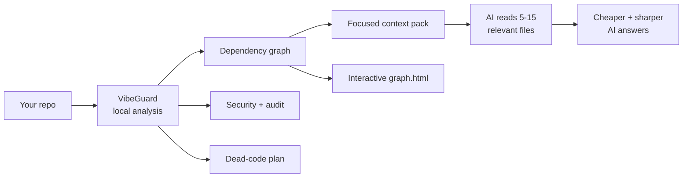
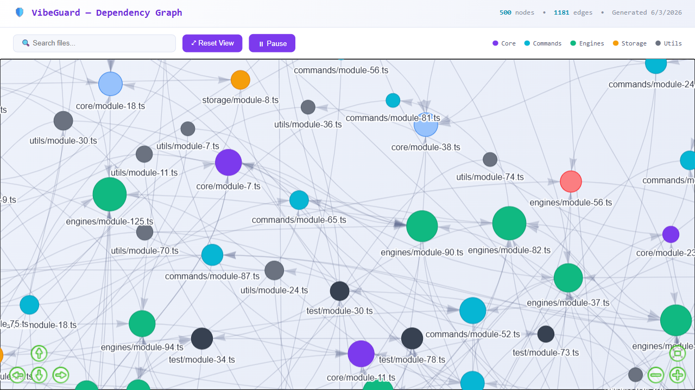

<div align="center">

# 🛡️ VibeGuard

### Your codebase, understood — by your AI and by you

*Map your project. Feed your AI only the files that matter. Catch secrets, attacks, and dead code.*
**100% local. No API key for the core. One command installs, one command runs.**

<br/>

[](https://nodejs.org/)
[](https://www.typescriptlang.org/)
[](#-development)
[](#-project-snapshot)
[](LICENSE)

<br/>

[**1. Install**](#-step-1-install-into-your-editor) ·
[**2. Run**](#-step-2-run-it) ·
[**Modes**](#-graphmode--caveman-mode) ·
[**Features**](#-features) ·
[**Commands**](#-command-map) ·
[**MCP Server**](#-mcp-server--live-agent-tools) ·
[**Security**](#-security--attack-coverage)

</div>

---

## 🚀 Step 1 — Install into your editor

**Pick your editor, run one command. That's the whole setup.** Each install writes the right
integration file (rules / instructions / MCP config), creates `.vibeguard/config.json`, enables
**Caveman Mode** + **GraphMode**, and offers to build the dependency map — in a single pass.

| Editor / Agent | One-shot install command | What it sets up |
| --- | --- | --- |
| **Antigravity** | `npx vibeguard antigravity install` | `AGENTS.md` rules + `.antigravity/mcp.json` MCP server |
| **VS Code** | `npx vibeguard vscode install` | `.github/copilot-instructions.md` + `.vscode/mcp.json` MCP server |
| **Kiro** | `npx vibeguard kiro install` | `.kiro/skills/vibeguard/` skill + steering + `.kiro/settings/mcp.json` |
| **Cursor** | `npx vibeguard cursor install` | `.cursor/rules/vibeguard.mdc` always-on rule + `.cursor/mcp.json` |
| **Claude Code** | `npx vibeguard claude install` | `CLAUDE.md` integration section |
| **GitHub Copilot** | `npx vibeguard copilot install` | `.github/copilot-instructions.md` |
| **Gemini** | `npx vibeguard gemini install` | `.gemini/CONTEXT.md` + `.gemini/settings.json` |
| **Aider** | `npx vibeguard aider install` | `.aider.context.md` (+ `.aider.conf.yml` if absent) |

Generic form + opt-outs:

```bash
# Any platform
npx vibeguard install --platform <kiro|cursor|claude|copilot|vscode|codex|gemini|aider|antigravity>

# Lean install (skip a step)
npx vibeguard install --platform vscode --no-caveman   # skip Caveman Mode
npx vibeguard install --platform vscode --no-map       # skip the graph build
npx vibeguard install --platform kiro --caveman ultra  # pick a Caveman level
```

> **After install, reload your editor / start a new chat** so it picks up the new rule + MCP server.
> Requirements: **Node.js ≥ 18**. Git is optional (enables hooks + git-aware scoring).
> Remove anytime with `npx vibeguard <platform> uninstall` — your `.vibeguard/` data is preserved.

---

## ▶️ Step 2 — Run it

The fastest way to use everything is the interactive menu:

```bash
npx vibeguard --run
```

It opens a menu ordered for a fresh project — **Quick Setup** first, then the modes, then scans:

```
Quick Setup            — Install all & become ready
GraphMode              — Use graph for token savings
Caveman Mode           — Save tokens & boost speed
Cyberattack Proof      — Scan for DDoS, SQLi, XSS, OTP abuse...
Security Scan          — Find secrets & vulnerabilities
Security Audit         — Deps (CVE), taint, misconfig + SBOM
Health Check           — Project health score
Dead Code Detection    — Find unused files & exports
Context Package        — Generate AI context
Trash Manager          — View soft-deleted files
Initialize Config      — Setup .vibeguard/
Configure LLM          — Add API key (OpenAI, Gemini, DeepSeek...)
```

**Quick Setup** does it all in one pick: init config, enable Caveman + GraphMode, then asks **how**
to build the dependency map (see [GraphMode](#-graphmode--caveman-mode) below).

Prefer flags? Every action has a one-line shortcut:

```bash
npx vibeguard --scan      # security scan
npx vibeguard --health    # project health score (0-100)
npx vibeguard --graph     # build + open the dependency graph
npx vibeguard --dead      # detect dead code
```

---

## 💡 Why VibeGuard?

AI assistants are strongest when they read the **right** code, not **all** the code.
VibeGuard builds a local, structured map of your project so your AI works with less
noise, fewer tokens, and higher accuracy — and you get a security and architecture
toolkit for free.



> **Core promise:** graph, security, dead-code, health, query, and packaging all run
> **locally with no AI API key**. Only the optional AI map / `attack --ai` review use your LLM.

---

## 🧠 GraphMode & Caveman Mode

Two **independent**, always-on modes. Either can be on or off without affecting the other. When ON,
each makes your AI assistant print a plain one-line indicator at the top of every reply:

```
Caveman mode: ON
GraphMode: ON
```

### GraphMode — graph-first context (token savings)

```bash
vibeguard graphmode on       # write graph-first rules to every IDE file
vibeguard graphmode status   # check state + detect drift
vibeguard graphmode off      # remove the rules everywhere
```

When you enable GraphMode (or run Quick Setup), VibeGuard asks **how to build the map**:

1. **Copy prompt for creating map** *(recommended — most accurate)* — copies a precise prompt;
   paste it into your coding agent (with repo access) and it writes `.vibeguard/graph.json`.
2. **Generate map using LLM** — uses your configured API key to build the map automatically.
3. **Create offline map** — local, no AI, instant (regex/AST based).

All three produce the same `graph.json` schema → identical `graph.html`. View with `vibeguard graph`.

### Caveman Mode — terse AI replies

Inspired by the [`caveman`](https://github.com/JuliusBrussee/caveman) skill. *(Rephrased for compliance.)*

```bash
vibeguard caveman on          # enable (default: full)
vibeguard caveman on ultra    # maximum compression
vibeguard caveman status      # check state + detect drift
vibeguard caveman off         # back to normal prose
```

| Level | Effect | ~Output savings (prose) |
| --- | --- | --- |
| `lite` | Drop filler & hedging, keep full sentences | ~20% |
| `full` | Drop articles, fragments OK (classic) | ~30% |
| `ultra` | Telegraphic, minimal words, arrows (X → Y) | ~45% |

> **Turning a mode off but still see the indicator?** The CLI strips the rule from every IDE file
> and `status` warns of any leftovers — but an **open AI chat caches instructions for its session**.
> Start a **new chat** (or reload the editor window) after toggling. Both `on` and `off` print this
> reminder, and `status` shows the exact project root + any drift so wrong-folder mistakes are obvious.

---

## ✨ Features

| | Capability |
| --- | --- |
| 🗺️ | **Dependency graph** — `graph.json`, interactive `graph.html`, `GRAPH_REPORT.md`; build offline, via LLM, or via copy-prompt |
| 🧠 | **GraphMode** — always-on graph-first context rule for your AI (independent toggle) |
| 🪨 | **Caveman Mode** — terse AI replies that trim output tokens (independent toggle) |
| 📦 | **AI context packs** — pick the few files that matter via tags, graph radius, importance & a token budget |
| 🔒 | **Security scanner** — hard-coded secrets, risky framework usage, `.env`/`.gitignore` gaps |
| 🛡️ | **Attack scanner** — 36 cyberattack patterns (SQLi, XSS, SSRF, XXE, SSTI, JWT, OTP abuse, DDoS, more) |
| 🔬 | **Unified audit** — dependency CVEs (SCA), taint dataflow, misconfig + service hardening → one 0-100 score + SBOM |
| ✂️ | **Dead-code cleanup** — works on any project (auto-detects entrypoints), plans unused files/exports into a recoverable trash |
| 🙈 | **Per-finding ignore** — silence a false positive by ID; scans never flag it again |
| ❓ | **Graph Q&A** — `query`, `path`, `explain`, `affected` — answers without reading every file |
| 🌐 | **Polyglot** — TS/JS (deep AST incl. CommonJS `require`), plus Python, Go, Java & Markdown |
| 🤝 | **Works everywhere** — Kiro, Cursor, Claude, Copilot, VS Code, Codex, Gemini, Aider, Antigravity |

---

## 🧭 Command Map

| Command | Purpose |
| --- | --- |
| `vibeguard --run` | Interactive menu — every feature, one keypress away |
| `vibeguard install --platform <name>` | One-shot editor/agent setup (or `vibeguard <platform> install`) |
| `vibeguard uninstall --platform <name>` | Remove editor/agent integration |
| `vibeguard init` | Initialize `.vibeguard/config.json` + build the graph |
| `vibeguard map` | Build the dependency graph (incremental, SHA-256 change detection) |
| `vibeguard graph --no-open` | Generate / open the interactive HTML graph |
| `vibeguard graphmode on\|off\|status` | Control GraphMode (graph-first AI context) |
| `vibeguard caveman on\|off\|status\|level` | Control Caveman Mode |
| `vibeguard query "question"` | Ask graph-backed questions, no full-file reads |
| `vibeguard path <a> <b>` | Shortest path between two nodes |
| `vibeguard explain <node>` | Explain a file/node role & connections |
| `vibeguard affected <node>` | Transitive dependents impacted by a change |
| `vibeguard flows` | Execution flows, bridges & knowledge gaps |
| `vibeguard search "query"` | Hybrid keyword + semantic search (local) |
| `vibeguard pack "task"` | Build `.vibeguard/context-package.md` + `.json` |
| `vibeguard benchmark` | Estimate token reduction vs full-repo reading |
| `vibeguard review` | Risk-scored review of changed files |
| `vibeguard security` | Scan secrets & framework security gaps |
| `vibeguard attack [--ai] [--fix]` | Cyberattack scan (+ optional AI review/fix) |
| `vibeguard audit [--sbom] [--min-severity]` | Unified security audit + 0-100 score |
| `vibeguard ignore add\|remove\|list <id>` | Suppress specific findings by ID |
| `vibeguard clean --plan \| --apply` | Detect dead code → recoverable trash |
| `vibeguard trash list \| restore <id>` | Manage soft-deleted files |
| `vibeguard add <file.pdf>` | Link PDF concepts into the graph |
| `vibeguard watch` | Rebuild graph data on file changes |
| `vibeguard hook install` | Pre-commit secret-blocking hook |
| `vibeguard serve` (alias `mcp`) | Start the MCP server (live agent tools) |
| `vibeguard doctor` | Aggregate findings into a 0-100 health score |
| `vibeguard config set-key\|show\|test` | Manage LLM provider API keys (for AI scans) |

Every machine-facing command supports `--json` and emits a `schemaVersion` field.

---

## 🔌 MCP Server — Live Agent Tools

Instead of shelling out and screen-scraping, AI assistants can call VibeGuard's engines
directly as **Model Context Protocol** tools over stdio. Local, zero-network (except the
optional AI scan), **13 tools**.

```bash
vibeguard serve            # start the MCP server on stdio
vibeguard mcp              # alias for serve
vibeguard serve --tools get_minimal_context,pack_context,query_graph   # expose a subset
```

The per-IDE installers write the MCP config for you. Manual wiring:

**Claude Desktop / Claude Code** — `claude_desktop_config.json` or `.mcp.json`:

```jsonc
{
  "mcpServers": {
    "vibeguard": { "command": "npx", "args": ["vibeguard", "serve", "--cwd", "/abs/path/to/project"] }
  }
}
```

**Kiro** — `.kiro/settings/mcp.json` · **Cursor** — `.cursor/mcp.json`:

```jsonc
{
  "mcpServers": {
    "vibeguard": { "command": "npx", "args": ["vibeguard", "serve"], "disabled": false }
  }
}
```

**VS Code** — `.vscode/mcp.json` (note: VS Code uses the `servers` key):

```jsonc
{
  "servers": {
    "vibeguard": { "command": "npx", "args": ["vibeguard", "serve"] }
  }
}
```

### The 13 tools

| Tool | What it returns |
| --- | --- |
| `get_minimal_context` | Ultra-compact project summary (~100 tokens). Call first. |
| `pack_context` | Focused, token-budgeted file pack for a task. |
| `query_graph` | Answer a codebase question by traversing the graph. |
| `find_path` | Shortest dependency path between two files. |
| `explain_node` | A node's role, imports, dependents, importance. |
| `get_affected` | Blast radius: what transitively depends on a node. |
| `build_graph` | Build or incrementally update the graph. |
| `detect_dead_code` | Unused files & exports. |
| `scan_security` | Secrets, framework misuse, gitignore gaps. |
| `scan_attacks` | Cyberattack vulnerabilities. |
| `get_health` | Project Health Score with sub-scores. |
| `run_audit` | Unified audit → 0-100 security score. |
| `set_caveman` | Toggle Caveman Mode. |

---

## 🗺️ Interactive Dependency Graph

`vibeguard graph` builds a **self-contained interactive HTML map** of your codebase
(`.vibeguard/graph.html`) and opens it in the browser.

```bash
vibeguard map      # build/refresh graph data
vibeguard graph    # render + open the interactive view
```

- **2D force-directed layout** — nodes auto-arrange by connectivity, then physics freezes
- **Group colors** — core, commands, engines, storage, utils, tests
- **Search box** — type a filename; matches highlight, the rest dim
- **Tap-hold + drag to pan** — move the whole map like dragging an image
- **Click a node** — highlights connections and opens a links panel (Imports / Dependents)
- **Degree-scaled nodes** — busier files render larger (god-node spotting)

Connections are extracted from **real imports** across languages and module systems — ESM
`import`, `export … from`, dynamic `import()`, CommonJS `require()`, plus Python/Go/Java/Markdown —
resolved across every extension and folder/index file.

<p align="center">
  <a href="docs/assets/graph-demo.html">
    
  </a>
</p>

---

## 📊 Project Snapshot

| Signal | Result |
| --- | --- |
| Test suite | **388** passing — unit, integration & property-based |
| Type gate | `npm run lint` + `npm run build` pass clean |
| Health score | **93 / 100** |
| Dependency graph | local, incremental, SHA-256 change detection |
| Token benchmark | graph read ≈ **88% smaller** than full-repo read |

---

## 🔐 Security & Attack Coverage

VibeGuard ships **three local scanners** plus an optional AI deep-scan. All run offline with
no API key (only `attack --ai` uses your configured LLM).

```bash
vibeguard security                    # secret + framework scan
vibeguard attack                      # cyberattack pattern scan (36 types)
vibeguard audit                       # unified 5-engine audit + 0-100 score
vibeguard attack --ai --fix           # AI deep-scan + auto-fix (with backups)
```

False positive? Silence one finding by its ID — it's never flagged again:

```bash
vibeguard ignore add SEC-016-1a2b3c4d   # stop flagging this finding
vibeguard ignore list                   # see ignored findings
vibeguard ignore remove SEC-016-1a2b3c4d
```

### `security` — secrets & framework misuse (18 detectors)

Hard-coded credentials and risky framework usage, low-false-positive (entropy + format +
context validation), with an `.env`/`.gitignore` gap check. Vendored / `node_modules`
(at any depth) and minified bundles are skipped to avoid noise.

- **Secrets:** OpenAI, Anthropic, AWS access key + secret, JWT secret, DB URL, Supabase,
  Google/Gemini, GitHub token, Stripe key, Slack token, Twilio SID, PEM private keys,
  generic api-key/token assignments.
- **Framework:** CORS wildcard origin, `cors()` with no config, hard-coded `ACAO: *`.
- **Hygiene:** `.env` present but missing from `.gitignore`.

### `attack` — cyberattack vulnerabilities (36 detectors, OWASP-aligned)

Mitigation-aware: a finding is suppressed when a matching defense is present in the file.

| Category | Covered attack types |
| --- | --- |
| **Injection** | SQLi (interpolation + concat), NoSQLi, XSS, command injection, XXE, insecure deserialization, SSTI, prototype pollution, `eval`/`new Function` RCE, CRLF / response splitting, LDAP injection |
| **Auth** | Brute force / credential stuffing, OTP abuse / SMS bombing, CSRF, JWT `none`-algorithm, `jwt.decode` without verify |
| **Access control** | Path traversal, SSRF, open redirect, mass assignment, unrestricted file upload, CORS origin reflection, insecure `postMessage` target |
| **Cryptography** | Weak hashing (MD5/SHA1), weak password hashing, insecure `Math.random()`, disabled TLS validation, hardcoded session secret, timing-unsafe secret compare |
| **Availability** | DDoS / resource exhaustion (missing rate limits), ReDoS (user-built RegExp) |
| **Hardening** | Missing security headers (helmet/CSP), insecure cookie flags, service bound to `0.0.0.0` |
| **Disclosure** | Sensitive data in logs, stack-trace exposure in responses |

### `audit` — unified offline audit (best-of Trivy + Semgrep + CodeQL)

`vibeguard audit` runs **five local engines** in one pass → a single **0-100 security score**.

| Engine | Inspired by | What it finds |
| --- | --- | --- |
| Dependency audit (SCA) | Trivy | Known-vulnerable deps (bundled advisory DB), deprecated packages, risky licenses |
| SBOM | Trivy | CycloneDX component inventory (`--sbom`) |
| Taint dataflow | Semgrep / CodeQL | Untrusted sources → dangerous sinks (exec, eval, query, innerHTML, fetch, fs), sanitizer-aware |
| Misconfiguration + hardening | Trivy + dev-sec | Dockerfile, `.env`, CI workflows, `tsconfig`, **SSH `sshd_config`, nginx, MySQL** baselines |
| Secrets + attacks | — | Reuses the secret + cyberattack scanners |

Supported AI providers for `--ai`: OpenRouter, OpenAI, Anthropic, Google Gemini, DeepSeek,
Groq, Mistral, xAI, Together, Perplexity, Fireworks, DeepInfra, Moonshot/Kimi, Ollama, and
any custom OpenAI-compatible endpoint.

> **Honest limit:** these are static heuristics — they catch common, pattern-detectable
> issues, not logic flaws, business-process abuse, or runtime-only vulnerabilities. Treat
> VibeGuard as a strong first line, not a full replacement for a security audit.

### Safety model

| Guarantee | Behavior |
| --- | --- |
| Local core | Graph, security, health, dead-code, query, pack need no cloud AI |
| Read-only default | Mutations require explicit `--fix`, `--apply`, or hook/integration install |
| Recoverable | Removed files go to `.vibeguard-trash/` |
| Project boundary | Safety checks reject paths outside the project root |
| Secrets | LLM credentials live in `.vibeguard/credentials.json` with restrictive perms |

---

## 🧩 Programmatic API

```ts
import { generateContextForEditor, serializeContextPackageForAgent } from 'vibeguard';

const pkg = await generateContextForEditor('fix auth login', { radius: 2, budget: 12000, mode: 'bugfix' });
const markdown = serializeContextPackageForAgent(pkg);
```

---

## 🛠️ Development

```bash
git clone https://github.com/Faizan-8792/Vibeguard-cli.git
cd Vibeguard-cli
npm install
npm run lint     # tsc --noEmit
npm run build    # tsc
npm test         # vitest — 388 tests
```

---

<div align="center">

**MIT licensed** — see [`LICENSE`](LICENSE) · Built for developers who want their AI to *understand* the codebase, not just read it.

</div>
