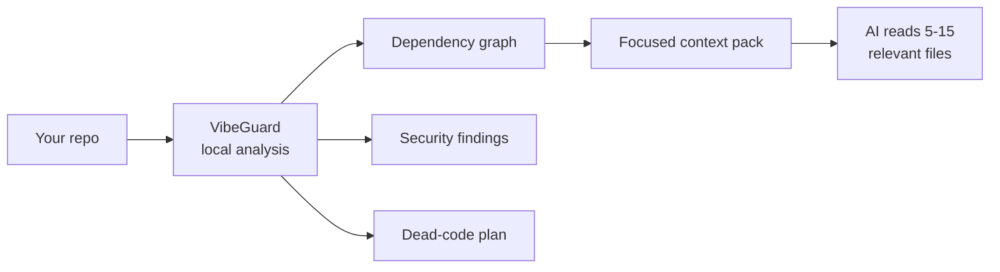

<div align="center">

# 🛡️ VibeGuard

### Local-first codebase intelligence for AI coding workflows

*Map your code. Feed your AI only what matters. Catch secrets and dead code. Cut output tokens.*
**All on your machine — no API key for the core.**

<br/>

[](https://nodejs.org/)
[](https://www.typescriptlang.org/)
[](#-development)
[](#-project-snapshot)
[](LICENSE)

<br/>

[**Quick Start**](#-quick-start) ·
[**Features**](#-features) ·
[**Commands**](#-command-map) ·
[**Caveman Mode**](#-caveman-mode--save-tokens--boost-speed) ·
[**Safety**](#-safety-model)

</div>

---

## 💡 Why VibeGuard?

AI assistants are strongest when they read the **right** code, not **all** the code.
VibeGuard gives them a local, structured map of your project so they work with less
noise, fewer tokens, and higher accuracy.



> **Core promise:** graph, security, dead-code, health, query, packaging, and Caveman
> compression all run **locally with no AI API key**. Only the optional `attack --ai`
> review and auto-fix use your configured LLM provider.

---

## 📊 Project Snapshot

Measured against this repository:

| Signal | Result |
| --- | --- |
| 🧪 Test suite | **319** passing — unit, integration & property-based |
| 🔒 Type gate | `npm run lint` + `npm run build` pass clean |
| 🏥 Health score | **93 / 100** |
| 🗺️ Dependency graph | local, incremental, SHA-256 change detection |
| 🛡️ Security scan | **0** outstanding findings |
| ✂️ Token benchmark | graph read ≈ **88% smaller** than full-repo read |

---

## ✨ Features

| | Capability |
| --- | --- |
| 🗺️ | **Dependency graph** — `.vibeguard/graph.json`, an interactive `graph.html`, and a `GRAPH_REPORT.md` architecture summary |
| 📦 | **AI context packs** — pick the few relevant files for a task via tags, graph radius, importance & token budget |
| 🔒 | **Security scanner** — hard-coded secrets, risky framework usage, `.env`/`.gitignore` gaps |
| 🛡️ | **Attack scanner** — SQLi, XSS, SSRF, command injection, path traversal, weak crypto, open redirect, brute force, OTP abuse, missing rate limits & more |
| ✂️ | **Dead-code cleanup** — plan unused files/exports, apply into a recoverable `.vibeguard-trash/` |
| ❓ | **Graph Q&A** — `query`, `path`, `explain`, `affected` — answers without reading every file |
| 🌐 | **Polyglot** — TS/JS (deep AST), plus Python, Go, Java & Markdown with language-aware edges |
| 🤝 | **Agent integrations** — Kiro, Cursor, Claude Code, Copilot, Gemini, Aider, Windsurf |
| 🪨 | **Caveman Mode** — always-on rules that make your AI reply terse, cutting **35–75%** of output tokens |

---

## 🚀 Quick Start

```bash
# 1. Initialize  → creates .vibeguard/ (gitignored)
npx vibeguard init

# 2. Map         → build the dependency graph
npx vibeguard map

# 3. Pack        → focused context for an AI task
npx vibeguard pack "fix the auth login flow"

# 4. Check       → quality + security
npx vibeguard doctor
npx vibeguard security
```

**Install:**

```bash
npx vibeguard --help          # run directly
npm install -g vibeguard      # or install globally
```

Requirements: **Node.js ≥ 18** · a project directory · Git (optional, needed for hooks + git-aware scoring).

**One-key shortcuts:**

```bash
npx vibeguard --run      # 🖥️  interactive terminal UI
npx vibeguard --scan     # 🔒  security scan
npx vibeguard --health   # 🏥  project health score
npx vibeguard --graph    # 🗺️  build dependency graph
npx vibeguard --dead     # ✂️  dead-code plan
```

---

## 🪨 Caveman Mode — Save Tokens & Boost Speed

> *"Why use many token when few do trick."*

Makes your AI assistant reply like a smart caveman — drop filler, keep **100%**
technical accuracy, answer in dense fragments. Inspired by the
[`caveman`](https://github.com/JuliusBrussee/caveman) skill. *(Description rephrased for
compliance.)*

```bash
vibeguard caveman on          # enable (default: full)
vibeguard caveman on ultra    # max compression
vibeguard caveman level lite  # change level, stays on
vibeguard caveman status      # check state
vibeguard caveman benchmark   # real measured savings per level
vibeguard caveman off         # back to normal prose
```

**Levels**

| Level | Effect | ~Output savings |
| --- | --- | --- |
| `lite` | Drop filler & hedging, keep full sentences | ~35% |
| `full` | Drop articles, fragments OK (classic) | ~65% |
| `ultra` | Telegraphic, abbreviations, arrows (X → Y) | ~75% |

**Always know it's on** — every reply begins with a visible badge:

```text
🪨 Caveman mode: ON (ultra)
```

**Works across IDEs** — enabling writes an always-on rule the assistant reads each turn:

- **Kiro** → `.kiro/steering/vibeguard-caveman.md` (`inclusion: always`)
- **Cursor** → `.cursor/rules/vibeguard-caveman.mdc` (`alwaysApply: true`)
- **Windsurf** → `.windsurf/rules/vibeguard-caveman.md` (`trigger: always_on`)
- **CLAUDE.md · Copilot · Gemini · AGENTS.md · .windsurfrules · .clinerules** → a marker-fenced block, only if the file already exists (no repo litter)

One-step setup: `vibeguard install --platform kiro --caveman ultra`.
An AI agent can also toggle it live via the MCP `set_caveman` tool, and `vibeguard doctor` reports its status.

> ⚠️ **Reload to activate.** Assistants read always-on rules at the **start of a chat**.
> After `caveman on`, open a **new chat** (or reload the IDE window) so the rule loads.
> Code, commits, and security warnings always stay in full prose — safety first.

---

## 🧭 Command Map

| Command | Purpose |
| --- | --- |
| `vibeguard init` | Initialize `.vibeguard/config.json` |
| `vibeguard map` | Build graph, tags, importance, HTML & report |
| `vibeguard graph --no-open` | Generate the interactive HTML graph |
| `vibeguard query "question"` | Ask graph-backed questions, no full-file reads |
| `vibeguard path <a> <b>` | Shortest path between two nodes |
| `vibeguard explain <node>` | Explain a file/node role & connections |
| `vibeguard affected <node>` | Transitive dependents impacted by a change |
| `vibeguard flows` | Execution flows, bridges & knowledge gaps |
| `vibeguard search "query"` | Hybrid keyword + semantic search (local) |
| `vibeguard pack "task"` | Build `.vibeguard/context-package.md` + `.json` |
| `vibeguard benchmark` | Estimate token reduction vs full-repo reading |
| `vibeguard review` | Risk-scored review of changed files |
| `vibeguard security` | Scan secrets & framework security gaps |
| `vibeguard security --fix gitignore\|env` | Auto-fix the common gaps |
| `vibeguard attack [--ai] [--fix]` | Cyberattack scan (+ optional AI review/fix) |
| `vibeguard audit [--sbom] [--min-severity]` | Unified security audit: dependency CVEs, taint dataflow, misconfig, secrets & attacks (+ CycloneDX SBOM) |
| `vibeguard clean --plan \| --apply` | Detect dead code → recoverable trash |
| `vibeguard trash list \| restore <id>` | Manage soft-deleted files |
| `vibeguard add <file.pdf>` | Link PDF concepts into the graph |
| `vibeguard watch` | Rebuild graph data on file changes |
| `vibeguard hook install` | Pre-commit secret-blocking hook |
| `vibeguard serve` (alias `mcp`) | Start the MCP server (live agent tools) |
| `vibeguard caveman on\|off\|status\|level\|benchmark` | Control Caveman Mode |
| `vibeguard install --platform <name>` | Install editor/agent integration |

---

## 🔌 JSON Contracts

Every machine-facing command supports `--json` and emits a `schemaVersion`.

```bash
vibeguard --json doctor
vibeguard --json map
vibeguard --json pack "refactor payments"
```

```json
{
  "schemaVersion": "1.0.0",
  "summary": {
    "projectHealth": 93,
    "security": 100,
    "deadCode": 90,
    "architecture": 100,
    "contextEfficiency": 81
  }
}
```

---

## 📦 Context Packaging

```bash
vibeguard pack "add validation to checkout form" --budget 12000 --radius 2
```

VibeGuard ranks files by:

1. Task term / tag matching
2. Export, route, framework & path-derived tags
3. Graph distance from the best matches
4. Importance (dependents, imports, git activity, route signals)
5. Token-budget enforcement

→ Outputs `.vibeguard/context-package.md` and `.vibeguard/context-package.json`.

---

## 🛡️ Security & Attack Coverage

```bash
vibeguard security                                   # local pattern scan
vibeguard attack                                     # broader attack patterns
vibeguard config set-key <key> --provider openrouter # optional AI review
vibeguard attack --ai
```

Supported AI providers: OpenRouter, OpenAI, Anthropic, Google Gemini, DeepSeek, Groq,
Mistral, xAI, Together, Perplexity, Fireworks, DeepInfra, Moonshot/Kimi, Ollama, and any
custom OpenAI-compatible endpoint.

---

## 🤝 Editor & Agent Setup

```bash
vibeguard install --platform kiro      # also: cursor, claude, copilot, gemini, aider
vibeguard install --platform kiro --caveman ultra   # + enable Caveman in one step
```

Shortcut aliases: `vibeguard kiro install`, `vibeguard cursor install`, etc.
Use `uninstall` / `<platform> uninstall` to remove generated files. Unknown platforms are
rejected rather than silently installing the wrong target.

---

## 🔐 Safety Model

| Guarantee | Behavior |
| --- | --- |
| 🏠 Local core | Graph, security, health, dead-code, benchmark, query, pack & Caveman need no cloud AI |
| 👀 Read-only default | Mutations require explicit `--fix`, `--apply`, hook install, or integration install |
| 🧪 Dry runs | Mutating security & cleanup flows support `--dry-run` |
| ♻️ Recoverable | Removed files go to `.vibeguard-trash/` |
| 🚧 Project boundary | Safety checks reject paths outside the project root |
| 📐 Machine contracts | JSON output is schema-versioned and integration-tested |
| 🔑 Secrets | LLM credentials live in `.vibeguard/credentials.json` with restrictive perms where supported |

---

## 📁 Files VibeGuard Writes

```text
.vibeguard/
  config.json            graph.json            graph.html
  GRAPH_REPORT.md        context-package.md    context-package.json
  analysis-meta.json     documents.json        caveman.json

.vibeguard-trash/        ← recoverable cleanup entries
```

Integration commands may also create platform files such as
`.kiro/steering/vibeguard.md`, `.cursor/rules/vibeguard.mdc`, `CLAUDE.md`,
`.github/copilot-instructions.md`, `.gemini/CONTEXT.md`, or `.aider.context.md`.

---

## 🧩 Programmatic API

```ts
import {
  generateContextForEditor,
  serializeContextPackageForAgent,
} from 'vibeguard';

const pkg = await generateContextForEditor('fix auth login', {
  radius: 2,
  budget: 12000,
  mode: 'bugfix',
});

const markdown = serializeContextPackageForAgent(pkg);
```

---

## 🛠️ Development

```bash
git clone https://github.com/Faizan-8792/VIBEGUARD-.git
cd VIBEGUARD-
npm install
npm run lint     # tsc --noEmit
npm run build    # tsc
npm test         # vitest — 319 tests
npm pack --dry-run
```

Validation status: lint ✓ · build ✓ · `319` tests ✓ · `npm pack` includes `dist/`,
`README.md`, `ROADMAP.md`, `LICENSE`, `package.json`.

---

## ⚖️ Honest Limits

- TS/JS use `ts-morph` AST analysis for imports/exports and semantic edges.
- Python, Go, Java & Markdown get deep portable analysis (imports, exports, declared
  symbols, package scopes, same-package links, doc references, semantic call/type edges).
- Dead-code results can have false positives around dynamic imports, reflection, generated
  files, and framework magic — always review a `--plan` before `--apply`.
- `attack --ai` / `--fix` require a configured LLM provider and use that provider's network.

---

<div align="center">

**MIT licensed** — see [`LICENSE`](LICENSE) · Built for developers who want their AI to *understand* the codebase, not just read it.

</div>
